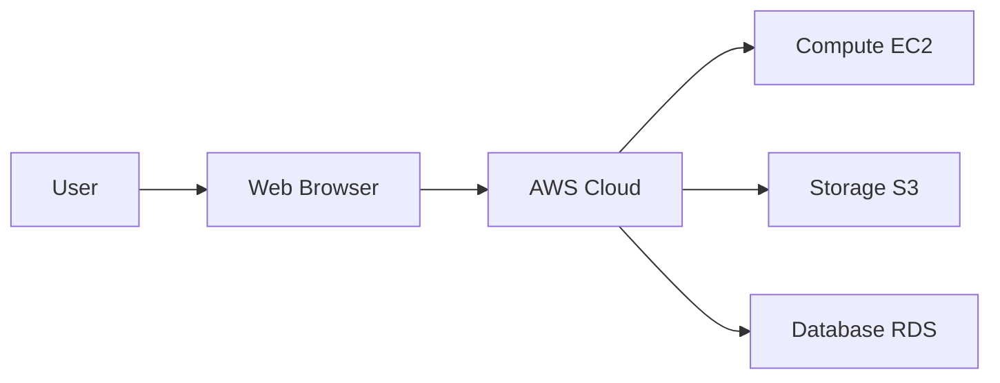

<div align="center">

# ☁️ Day 1: Introduction to AWS 


> **AWS Cloud Platform** — Day 1 of the 30+ Day AWS & Cloud Learning Journey 🚀

</div>

---

## 📌 Introduction

Introduction to AWS & Cloud Computing is a core component of AWS cloud infrastructure. Understanding **AWS Cloud Platform** is essential for building scalable, resilient, and cost-effective systems on AWS.

> 💡 **Why it matters:** This service is used in virtually every real-world AWS deployment — from startups to Fortune 500 enterprises. Mastering it opens doors to DevOps and Cloud engineering roles.

---

## 🧠 Key Concepts

- 🔹 **Cloud Computing Models**: IaaS, PaaS, SaaS
- 🔹 **On-Premises vs Cloud**: Cost, scalability, flexibility
- 🔹 **AWS Global Infrastructure overview**: 
- 🔹 **Shared Responsibility Model**: 
- 🔹 **Pay-as-you-go pricing model**: 
- 🔹 **AWS Free Tier**: 12 months of free usage for select services

---

## ⚙️ Commands & CLI Reference

> All examples use **AWS CLI v2**. Ensure you have run `aws configure` before executing.

| Command | Description | Example |
|---------|-------------|---------|
| `aws --version` | Check AWS CLI version installed | `aws --version` |
| `aws configure` | Configure AWS credentials and region | `aws configure` |
| `aws sts get-caller-identity` | Verify current AWS account identity | `aws sts get-caller-identity` |
| `aws s3 ls` | List all S3 buckets in account | `aws s3 ls` |
| `aws ec2 describe-regions` | List all available AWS regions | `aws ec2 describe-regions --output table` |
| `aws pricing get-products` | Query AWS pricing information | `aws pricing get-products --service-code AmazonEC2 --region us-east-1` |
| `aws account get-contact-information` | Get account contact details | `aws account get-contact-information` |
| `aws organizations describe-organization` | Describe current AWS organization | `aws organizations describe-organization` |

---

## 🔬 Practical Examples

### Scenario 1: Setting up AWS Free Tier account

**Steps:**
```
Navigate to aws.amazon.com → Create Account → Enter billing info → Select Free Tier → Verify identity
```

**Result:**
> Account active within minutes with $300 credits and free tier limits

### Scenario 2: Exploring the AWS Console

**Steps:**
```
Login → Explore Services menu → Search for EC2, S3, IAM → Pin frequently used services
```

**Result:**
> Console shows region selector top-right and service dashboard

### Scenario 3: Configuring AWS CLI

**Steps:**
```
Run `aws configure` → Enter Access Key ID → Secret Key → Region (us-east-1) → Output format (json)
```

**Result:**
> CLI ready: `aws sts get-caller-identity` returns account ID

---

## 📊 Architecture Diagram



---

## 🌍 Real-World Usage

- ✅ Teams migrate on-premises servers to AWS to reduce hardware costs
- ✅ Startups use AWS to launch globally without upfront capital
- ✅ DevOps engineers use AWS services for automated CI/CD pipelines
- ✅ Enterprises use hybrid cloud with AWS Direct Connect

---

## ✅ Summary

- 🎯 **Introduction to AWS & Cloud Computing** is a managed AWS service under **AWS Cloud Platform**
- 🔑 Key concepts: Cloud Computing Models, On-Premises vs Cloud
- 🛠️ Core CLI commands covered: `aws --version`, `aws configure`, `aws sts get-caller-identity`
- 🏗️ Best practice: Always follow the principle of least privilege and enable logging
- 💰 Cost tip: Right-size resources and use lifecycle policies to optimize spend
- 🔒 Security: Enable encryption, use IAM roles over access keys where possible

---

## 🔜 What's Next

| Next Topic | Description |
|------------|-------------|
| **Day 2: AWS Global Infrastructure (Regions, AZs)** |  |

---

## 👤 Author

<div align="center">

| | |
|---|---|
| **Name** | Vadla Gunanasekhar |
| **Role** | Ai Infra Engineer & DevOps  |
| **Learning** | 30+ Day AWS Challenge |
| **Connect** | [](https://github.com/gunasekharvadla) |

</div>

---

## ⭐ Support

If this helped you, please consider:

| Action | Why |
|--------|-----|
| ⭐ **Star the repo** | Helps others discover this resource |
| 🔁 **Share on LinkedIn** | Spread knowledge in the community |
| 👤 **Follow on GitHub** | Stay updated with new days |
| 🐛 **Open an issue** | Suggest improvements or corrections |

---

<div align="center">

*Part of the **30+ Day AWS & Cloud Learning** series*

  

</div>
