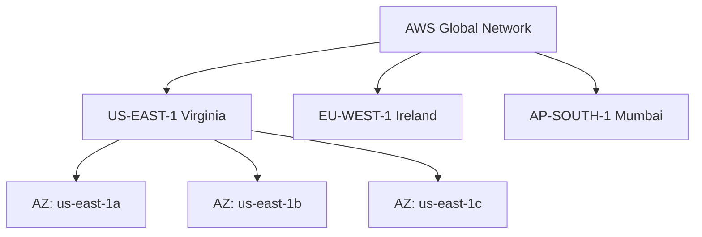

<div align="center">

# 🌍 Day 2: AWS Global Infrastructure (Regions, AZs)


> **AWS Global Infrastructure** — Day 2 of the 20+ Day AWS & Cloud Learning Journey 🚀

</div>

---

## 📌 Introduction

AWS Global Infrastructure (Regions, AZs) is a core component of AWS cloud infrastructure. Understanding **AWS Global Infrastructure** is essential for building scalable, resilient, and cost-effective systems on AWS.

> 💡 **Why it matters:** This service is used in virtually every real-world AWS deployment — from startups to Fortune 500 enterprises. Mastering it opens doors to DevOps and Cloud engineering roles.

---

## 🧠 Key Concepts

- 🔹 **Region**: Geographic area with multiple AZs (e.g. us-east-1)
- 🔹 **Availability Zone (AZ)**: Isolated data centers within a region
- 🔹 **Edge Locations**: CDN endpoints for CloudFront
- 🔹 **Local Zones**: Low-latency extensions of regions
- 🔹 **Wavelength Zones**: Ultra-low latency for 5G networks
- 🔹 **Data residency**: Choosing regions for compliance

---

## ⚙️ Commands & CLI Reference

> All examples use **AWS CLI v2**. Ensure you have run `aws configure` before executing.

| Command | Description | Example |
|---------|-------------|---------|
| `aws ec2 describe-regions` | List all enabled regions | `aws ec2 describe-regions --output table` |
| `aws ec2 describe-availability-zones` | List AZs in current region | `aws ec2 describe-availability-zones --region us-east-1` |
| `aws ec2 describe-availability-zones --all-availability-zones` | List all AZs including disabled | `aws ec2 describe-availability-zones --all-availability-zones` |
| `aws cloudfront list-distributions` | List CloudFront distributions | `aws cloudfront list-distributions` |
| `aws ec2 describe-regions --filters` | Filter regions by opt-in status | `aws ec2 describe-regions --filters "Name=opt-in-status,Values=opted-in"` |
| `aws account list-regions` | List all AWS regions with status | `aws account list-regions --region-opt-status-contains ENABLED` |
| `aws ec2 describe-local-zones` | Describe local zones | `aws ec2 describe-local-zones --region us-east-1` |
| `aws ec2 describe-instance-type-offerings` | Show AZ instance availability | `aws ec2 describe-instance-type-offerings --location-type availability-zone` |

---

## 🔬 Practical Examples

### Scenario 1: Checking available AZs for deployment

**Steps:**
```
Choose region → List AZs → Pick 2-3 AZs for high availability → Deploy app across them
```

**Result:**
> Multi-AZ deployment ensures 99.99% uptime SLA

### Scenario 2: Selecting region for GDPR compliance

**Steps:**
```
Client in Europe → Choose eu-west-1 (Ireland) or eu-central-1 (Frankfurt) → Data stays in EU
```

**Result:**
> Data residency requirements met; legal compliance achieved

### Scenario 3: Setting up CloudFront edge caching

**Steps:**
```
Create S3 bucket in us-east-1 → Create CloudFront distribution → Select edge locations → Map domain
```

**Result:**
> Static assets served from nearest edge, reducing latency by 60-70%

---

## 📊 Architecture Diagram



---

## 🌍 Real-World Usage

- ✅ Multi-region deployments for disaster recovery
- ✅ Latency-sensitive apps deploy near users
- ✅ Regulatory compliance drives region selection
- ✅ Edge locations accelerate global content delivery

---

## ✅ Summary

- 🎯 **AWS Global Infrastructure (Regions, AZs)** is a managed AWS service under **AWS Global Infrastructure**
- 🔑 Key concepts: Region, Availability Zone (AZ)
- 🛠️ Core CLI commands covered: `aws ec2 describe-regions`, `aws ec2 describe-availability-zones`, `aws ec2 describe-availability-zones --all-availability-zones`
- 🏗️ Best practice: Always follow the principle of least privilege and enable logging
- 💰 Cost tip: Right-size resources and use lifecycle policies to optimize spend
- 🔒 Security: Enable encryption, use IAM roles over access keys where possible

---

## 🔜 What's Next

| Next Topic | Description |
|------------|-------------|
| **Day 3: IAM (Users, Roles, Policies)** |  |

---

## 👤 Author

<div align="center">

| | |
|---|---|
| **Name** | Your Name |
| **Role** | DevOps & Cloud Learner |
| **Learning** | 30+ Day AWS Challenge |
| **Connect** |  [](https://github.com/gunasekharvadla) |

</div>

---

## ⭐ Support

If this helped you, please consider:

| Action | Why |
|--------|-----|
| ⭐ **Star the repo** | Helps others discover this resource |
| 🔁 **Share on LinkedIn** | Spread knowledge in the community |
| 👤 **Follow on GitHub** | Stay updated with new days |
| 🐛 **Open an issue** | Suggest improvements or corrections |

---

<div align="center">

*Part of the **30+ Day AWS & Cloud Learning** series*

  

</div>
